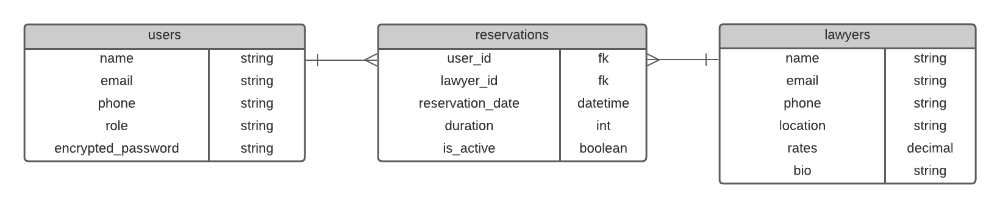

# Book a lawyer App

> This repository is a Ruby on Rails developed backend API only application  named "Book a lawyer App". The purpose of the project is to automate the law services. The Application allows an authenticated user to log in to the system, get a list of all available lawyers whose can be bookeed for a specified amount. The lawyers' bio has the contact details, location, pricing per hour of the lawyer from which a user gets more insights. It also has dedicated pages to see a user's reservations and a reserve form. An admin user has the right to add/remove a lawyer from the database and hence can see the Manage tab.


## Entity relationship diagram



# Front End repository

[Link to the front end repository](https://github.com/helio3197/book-a-lawyer-App-frontend)


## Built With

- Ruby version 3.1.2
- Rails 7.0.3
- PostgreSQL v 14.4
- Devise
- Cancancan
- JWT Auth

## Hosting services

- The project is hosted on Heruku
- AWS S3 is used as the production storage service.


## Configuration and set-up

- Kindly ensure the following environments have been installed on you system:
  + Ruby
  + PostgreSQL
  + Rails

- Cloning the repository
  - ```
    git clone https://github.com/richardoppiyo/book-a-lawyer-App-backend.git
    ```

- Navigate to the project's root folder:
  - ```
    cd book-a-lawyer-App-backend
    ```

- Install dependencies:
  - ```
    bundle install
    ```

- Add the master key to the project:
  - Create a new file called: `master.key` in `./config` directory
    - ```
      touch ./config/master.key
      ```
  - Add the development secret key `d6f114bd6f255f293dcf131f49fe7079` on the new created `master.key` file
    - ```
      echo "d6f114bd6f255f293dcf131f49fe7079" >> master.key
      ```

- Create the database:
  - ```
    rails db:create
    ```

- Run migrations:
  - ```
    rails db:migrate
    ```

## Usage

- Run the server on the specified port:

```
rails s --port=3000
```

- Available endpoints: Sessions and authentication
  - `POST /users/sign_in`:
    - Creates a new user session
    - Accepts a JSON string or FormData object in this format:
      ```
      user: {
        email: string,
        password: string,
      }
      ```
    - Responds in JSON:
      ```
      {
        result: 'success',
        user: user_object,
      }
      ```
    - Returns a JWT auth token in the response's header.
  - `POST /users`:
    - Create a new user
    - Accepts a JSON string or FormData object in this format:
      ```
      {
        user: {
          name: string
          email: string,
          phone: string,
          password: string,
          password_confirmation: string,
          avatar: File image/ jpg, png, gif # optional, only as FormData object
        },
      }
      ```
    - Responds in JSON:
      ```
      {
        result: 'success',
        user: user_object,
      }
      ```
    - Returns a JWT auth token in the response's header.
  - `DELETE /users/sign_out`:
    - Destroy the user's session
    - Requires the auth token in the request's header.
    - Responds in JSON:
      ```
      { result: 'success' }
      ```
  - `DELETE /users`:
    - Destroy the user's account
    - Requires the auth token in the request's header.
    - Responds in JSON:
      ```
      { result: 'success' }
      ```
  - `PATCH /users`:
    - Updates the user's account
    - Requires the auth token in the request's header.
    - Accepts a JSON string or FormData object in this format:
      ```
      {
        user: {
          name: string
          email: string,
          phone: string,
          password: string,
          password_confirmation: string,
          avatar: File: image/jpg, png, gif # optional, only as FormData object
        },
      }
      ```
    - Responds in JSON:
      ```
      {
        result: 'success',
        user: user_object,
      }
      ```
- Available endpoints: Lawyers
  - `GET /api/v1/lawyers`:
    - Return the list of lawyers:
    - Requires the auth token in the request's header.
    - Return a JSON string in this format:
      ```
      {
        lawyers: [
          {
            "id": int,
            "name": string,
            "phone": string,
            "email": string,
            "location": string,
            "rates": number,
            "bio": string,
            "created_at": datetime_string,
            "updated_at": datetime_string,
            "avatar_url": string,
          },
          ...
        ]
      }
      ```
  - `GET /api/v1/lawyers/:id`:
    - Returns a specific lawyer:
    - Requires the auth token in the request's header.
    - Return a JSON string in this format:
      ```
      {
        lawyer: {
          "id": int,
          "name": string,
          "phone": string,
          "email": string,
          "location": string,
          "rates": number,
          "bio": string,
          "created_at": datetime_string,
          "updated_at": datetime_string,
          "avatar_url": string,
        }
      }
      ```
  - `[admin] POST /api/v1/lawyers`:
    - Creates a new lawyer
    - Requires the auth token in the request's header.
    - Accepts a FormData object in this format:
      ```
      {
        lawyer: {
          id: int,
          name: string,
          phone: string,
          email: string,
          location: string,
          rates: number,
          bio: string,
          created_at: datetime_string,
          updated_at: datetime_string,
          avatar: File image/ jpg, png, gif,
        }
      }
      ```
    - Responds in JSON:
      ```
      {
        result: 'success',
        lawyer: lawyer_object,
      }
      ```
  - `[admin] DELETE /api/v1/lawyers/:id`:
    - Destroys a lawyer item
    - Requires the auth token in the request's header.
    - Responds in JSON:
      ```
      { result: 'success' }
      ```
  - `[admin] PATCH /api/v1/lawyers/:id`:
    - Updates  a lawyer
    - Requires the auth token in the request's header.
    - Accepts a FormData object in this format:
      ```
      {
        lawyer: {
          id: int,
          name: string,
          phone: string,
          email: string,
          location: string,
          rates: number,
          bio: string,
          created_at: datetime_string,
          updated_at: datetime_string,
          avatar: File image/ jpg, png, gif,
        }
      }
      ```
    - Responds in JSON:
      ```
      {
        result: 'success',
        lawyer: lawyer_object,
      }
      ```
- Available endpoints: Reservations
  - `GET /api/v1/reservations`:
    - Returns a list of reservations for the signed in user
    - Requires the auth token in the request's header.
    - Return a JSON string in this format:
      ```
      {
        "reservations": [
          {
              "id": number,
              "reservationdate": datetime_string,
              "is_active": boolean,
              "duration": number,
              "created_at": datetime_string,
              "updated_at": datetime_string,
              "user_id": number,
              "lawyer_id": number,
          },
          ...
        ]
      }
      ```
  - `POST /api/v1/reservations`:
    - Creates a reservations for the signed in user
    - Requires the auth token in the request's header.
    - Accepts a JSON object in this format:
      ```
      {
        reservation: {
          id: int,
          reservationdate: date,
          is_active: bolean,
          duration: int,
          lawyer_id: int,
        }
      }
      ```
    - Responds in JSON:
      ```
      {
        result: 'success',
        reservation: reservation_object,
      }
      ```
  - `DELETE /api/v1/lawyers/:id`:
    - Destroys a reservation for the signed in user 
    - Requires the auth token in the request's header.
    - Responds in JSON:
      ```
      { result: 'success' }
      ```
  - `PATCH  /api/v1/lawyers/:id`:
    - Updates a reservation for the signed in user
    - Requires the auth token in the request's header.
    - Accepts a JSON object in this format:
      ```
      {
        reservation: {
          id: int,
          reservationdate: date,
          is_active: bolean,
          duration: int,
          lawyer_id: int,
        }
      }
      ```
    - Responds in JSON:
      ```
      {
        result: 'success',
        reservation: reservation_object,
      }


## Authors

👤 **Richard Opiyo**

- GitHub: [@richaroppiyo](https://github.com/richardoppiyo)
- Twitter: [@blessed_ricky](https://twitter.com/blessed_ricky)
- LinkedIn: [LinkedIn](https://www.linkedin.com/in/richardoppiyo/)


👤 **Kenny Salazar**

- GitHub: [@helio3197](https://github.com/helio3197)
- Twitter: [@kennysalazar31](https://twitter.com/kennysalazar31)
- LinkedIn: [LinkedIn](https://linkedin.com/in/kenny-salazar-1a1687110)


## 🤝 Contributing

Contributions, issues, and feature requests are welcome!

Feel free to check the [issues page](../../issues/).

## Show your support

Give a ⭐️ if you like this project!

## Acknowledgments

- Microverse,
- Our coding partners, and
- Stand-up team members

## 📝 License

This project is [MIT](./LICENSE) licensed.
